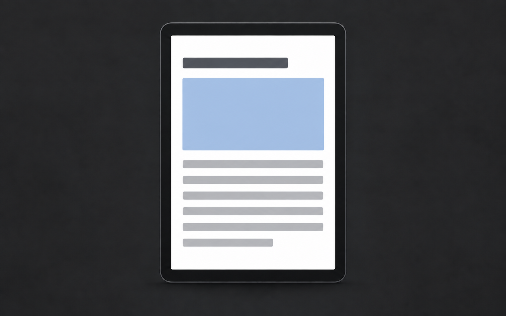
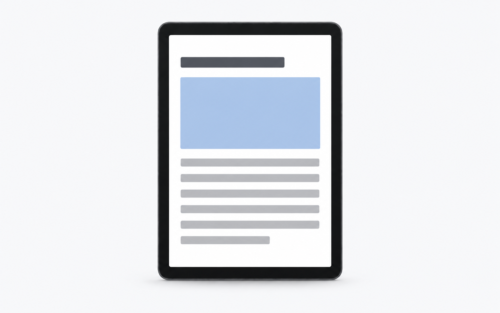

# Example release content

These fictional notes illustrate the public display contract. They are not release announcements for this toolkit or claims about a shipped product.

- [Korean bundle](release-notes.ko-KR.json)
- [English bundle](release-notes.en-US.json)
- [Generated explanations, scenes, prompts, and reviews](#composition-gallery)
- [Supplied-image workflow](provided-media/README.md) for real product details and content previews
- [Independent feature briefs](feature-briefs.yaml): an encryption symbol, a static setting, and a data breakdown

The independent briefs pair each fictional note with a different scene and its correctness constraints. They are authoring examples, separate from the public bundle format. The prompt compiler uses only the selected brief and recipe for each note; they do not inherit the list interaction from the raster example. The encryption and storage briefs also have rendered examples below; the quiet-hours brief remains a text-only alternative for `ui-detail`.

## Composition gallery

The gallery demonstrates generated explanations. Each displayed folder contains a shared `scene.yaml`, compiled prompts, selected PNGs, and a review. These are fictional authoring references, not default layouts. Physical details and actual content previews use the supplied-image workflow rather than synthetic examples.

| Recipe and example | Dark | Light |
| --- | --- | --- |
| [`icon-tile`: backup encryption](backup-encryption/README.md) |  |  |
| [`symbol-pair`: location preferences](location-preferences/README.md) |  |  |
| [`ui-detail`: queue action](queue-action/README.md) |  |  |
| [`device-view`: tablet reading](tablet-reading/README.md) |  |  |
| [`spatial-view`: connected route](connected-route/README.md) |  |  |
| [`data-view`: storage breakdown](storage-breakdown/README.md) |  |  |

The location pair uses no accent: equal neutral treatment explains a static association. The route uses color to distinguish its path from the surrounding map.

Use the tablet example to see how a light-only product screen stays light on both presentation canvases. Use an actual capture when device or interface fidelity matters. The storage values are illustrative, and the route has no real geographic identity.

`object-detail` and `editorial-scene` require an approved photograph, screenshot, or content asset. If none is available, the plan returns a supplied-image request with no generation prompt. [The supplied-media example](provided-media/README.md) shows that pending state and shared-asset import. Earlier synthetic physical-object and decorative-content explorations are retired and excluded from the package.

## Public bundles

Each bundle contains version 1.4.0 followed by 1.3.0 and 1.2.0. The explicit `previous` links define that order. The `queue-action` note appears in two different version groups because each describes that version's change; consumers retain both entries.

Both locales reference the same selected dark and light PNGs. Choose `image.variants[theme]`, falling back to `image.variants[image.fallbackTheme]` only when the requested variant is absent. Text-only notes use `image: null`. These are content examples; build the surrounding scrolling interface in the consumer application.
