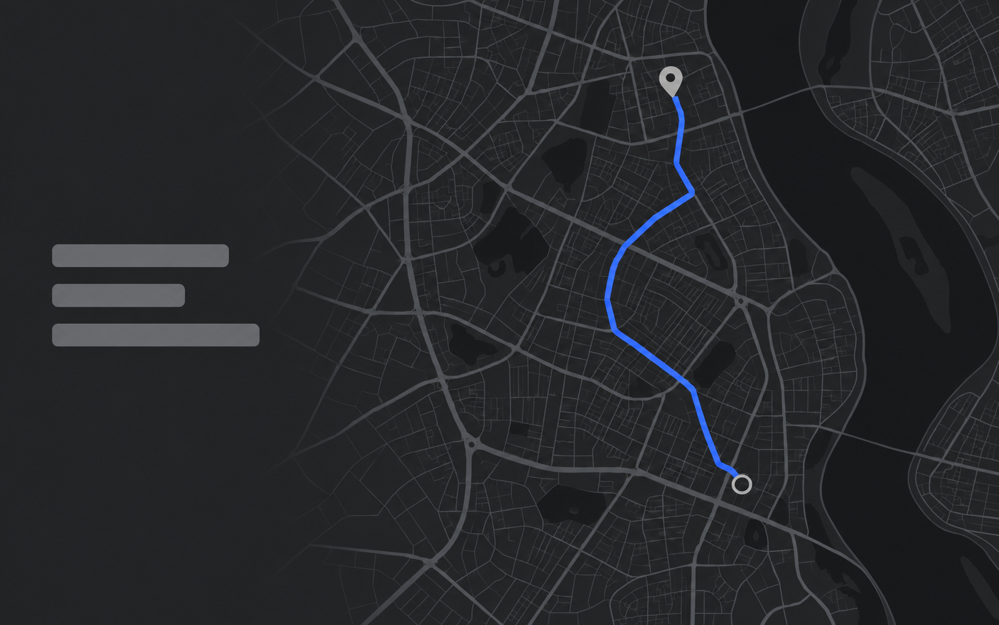
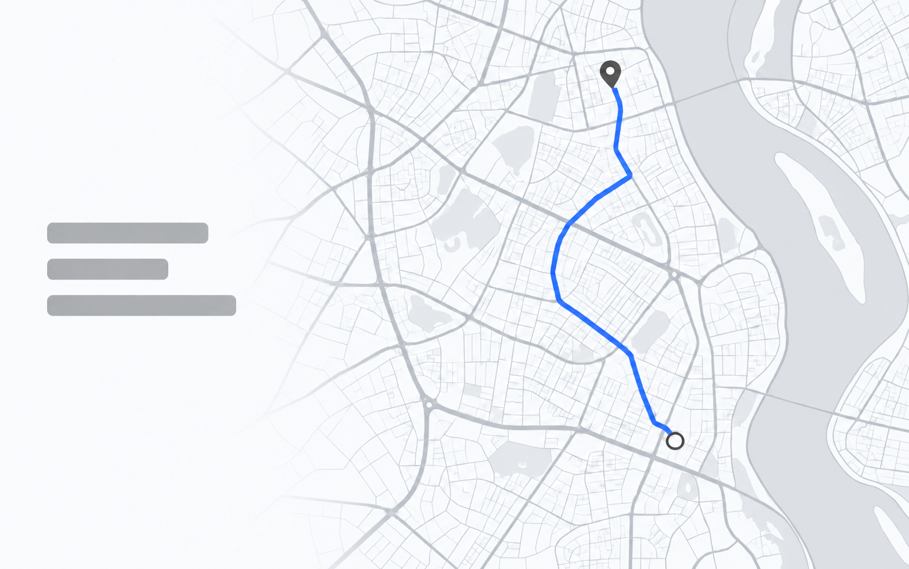

# Connected route

An original fictional `spatial-view` example: the route preview connects two selected saved waypoints through a city street network.

Fine streets retain cartographic context at low contrast. One blue path carries the focus; a quiet area beside the map holds three abstract route-summary labels. Land, water, and supporting streets stay neutral. The map crop and summary placement belong to this scene, not every spatial note.

The geography is explicitly illustrative. It is not a real location, a computed navigation result, or evidence of a shipped product. An actual place, route, or coverage claim needs an approved map capture or verified source. No live-navigation arrow, traffic, or travel estimate is implied.

| Dark | Light |
| --- | --- |
|  |  |

Both selected PNGs are 1585 × 992 pixels. The pair review records the inspected output and its visual limitations.

- [Shared scene specification](scene.yaml)
- [Dark prompt](dark.prompt.md) and [light prompt](light.prompt.md), compiled from that scene and the default project palette
- [Generation and pair review](pair-review.md)
- [Actual render and correction requests](render-requests.md)
- [Map hierarchy and selection guidance](../../kit/references/composition-recipes.md#map-hierarchy-within-spatial-views)
- [Generated or supplied media](../../kit/references/media-sources.md)
- [Current composition examples](../README.md#composition-gallery)

The scene explains this feature only. Derive a new scene from each real note and its product evidence.
