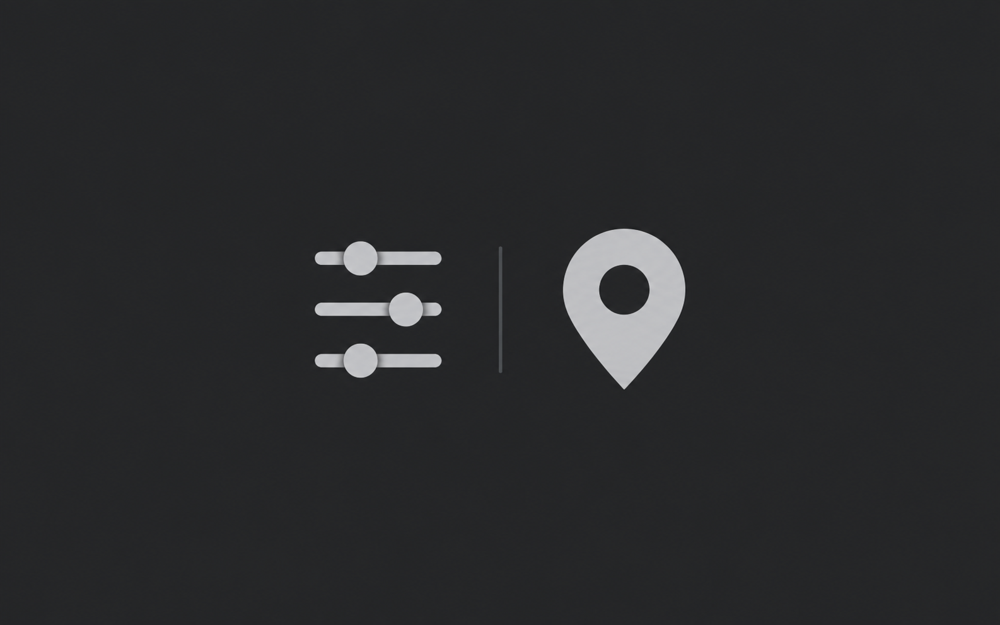
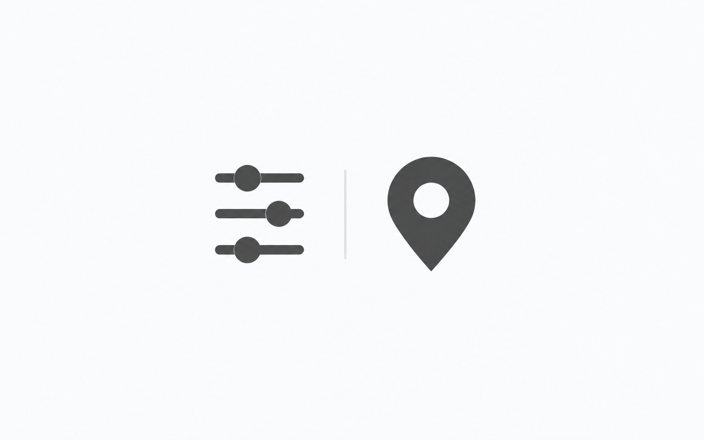

# Location preferences

An original fictional `symbol-pair` example: Preferences can be saved for an individually selected location.

Original fictional example. The written scene is the complete product specification for this example, not evidence of a shipped product.

| Dark | Light |
| --- | --- |
|  |  |

Both selected PNGs are 1586 × 992 pixels. Both symbols use the same neutral treatment within each theme. This is a static association, so the image needs no accent or implied selected state.

The earlier `dark.png` and `light.png` remain as source images for the revision; the gallery selects `dark-neutral.png` and `light-neutral.png`.

- [Shared scene specification](scene.yaml)
- [Dark prompt](dark.prompt.md) and [light prompt](light.prompt.md), compiled from that scene and the default project palette
- [Concrete neutral-edit requests](neutral-edit-requests.md)
- [Generation and pair review](pair-review.md)
- [Current composition examples](../README.md#composition-gallery)

The scene explains this feature only. Derive a new scene from each real note and its product evidence.
