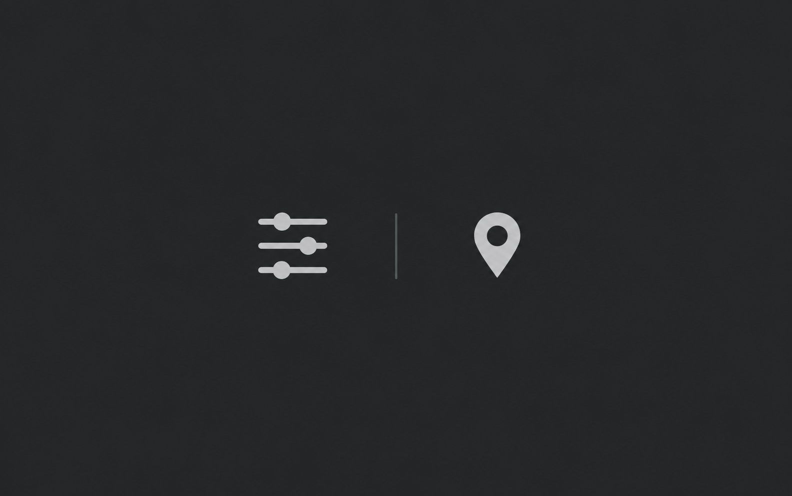
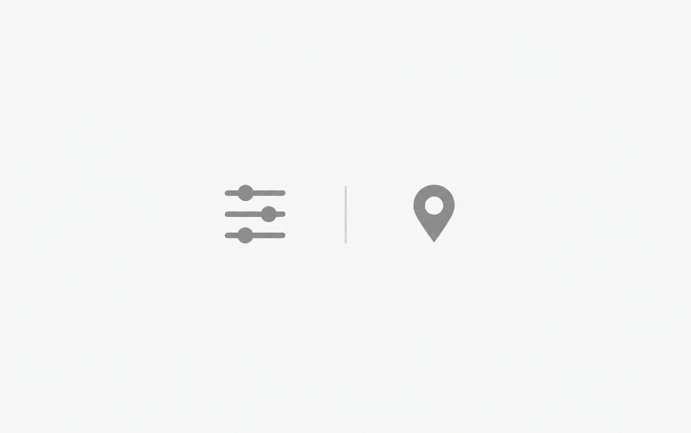

# Location preferences

An original fictional `symbol-pair` example: Preferences can be saved for an individually selected location.

Original fictional example. The written scene is the complete product specification for this example, not evidence of a shipped product.

| Dark | Light |
| --- | --- |
|  |  |

The pair uses compact glyphs with comparable filled ink weight and broad margins. Both symbols use the same neutral treatment within each theme. This is a static association, so the image needs no accent or implied selected state. Both selected PNGs are 1584 × 993 pixels; the pair review records the checks.

The gallery selects `dark-refined.png` and `light-refined.png`. The dark revision reduces the symbol footprint and balances the solid pin against the sparse adjustment glyph. The light counterpart retains this geometry with medium-gray `primary` glyphs and a subtle `divider`. Each theme uses its own saved values. Earlier PNGs remain as revision sources.

- [Shared scene specification](scene.yaml)
- [Dark prompt](dark.prompt.md) and [light prompt](light.prompt.md), compiled from that scene and the default project palette
- [Concrete neutral-edit requests](neutral-edit-requests.md)
- [Earlier light palette edit request](light-palette-edit.prompt.md)
- [Dark refinement](dark-refinement.prompt.md), [size correction](dark-size-correction.prompt.md), and [ink-weight correction](dark-weight-correction.prompt.md)
- [Light counterpart request](light-refinement.prompt.md)
- [Generation and pair review](pair-review.md)
- [Current composition examples](../README.md#composition-gallery)

The scene explains this feature only. Derive a new scene from each real note and its product evidence.
