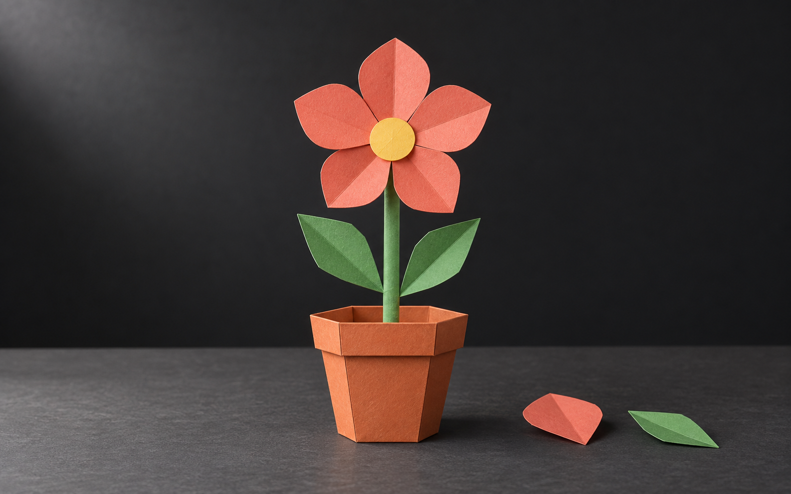
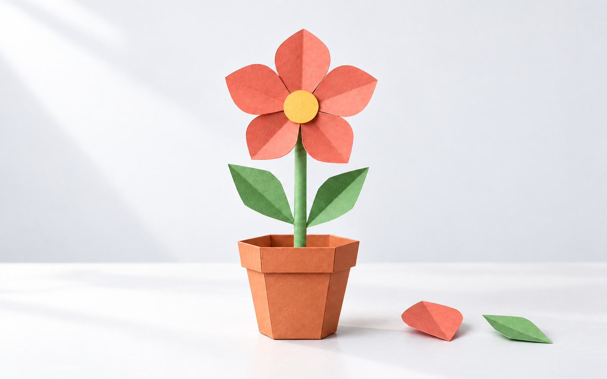

# Paper garden

This is a retired decorative illustration experiment, not a current generation recipe or an approved content reference. It is excluded from the distributed package. Content previews now require actual artwork, a screenshot, or another approved image through the [supplied-image workflow](../provided-media/README.md). The files below are retained only as historical work; do not use the old prompts to invent missing product content.

An original fictional `editorial-scene` example: A new craft lesson shows how to assemble a small paper garden.

The former written fictional scene is not actual product content and does not satisfy the current supplied-image requirement.

| Dark | Light |
| --- | --- |
|  |  |

Both selected PNGs are 1586 × 992 pixels.

- [Shared scene specification](scene.yaml)
- [Dark prompt](dark.prompt.md) and [light prompt](light.prompt.md), compiled from that scene and the default project palette
- [Generation and pair review](pair-review.md)
- [All eight composition examples](../README.md#composition-gallery)

The scene explains this feature only. Derive a new scene from each real note and its product evidence.
