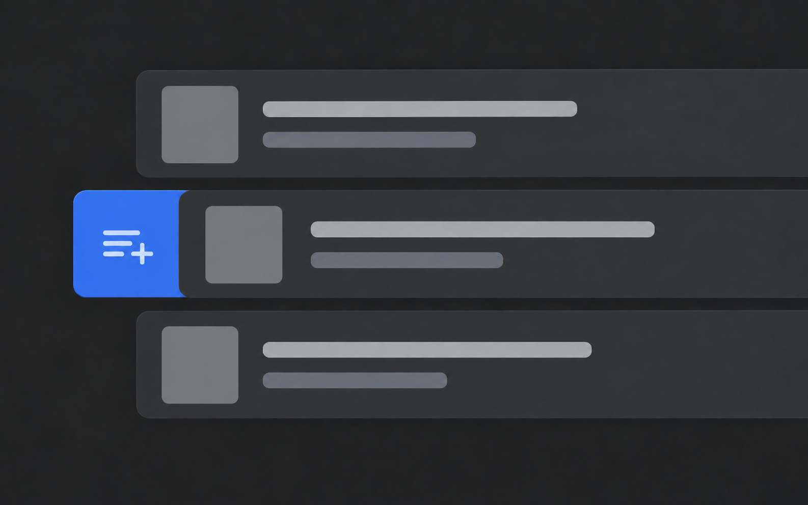

# Paired illustration example

This fictional list interaction demonstrates the shared scene contract and theme-specific prompts. It is not a screenshot or a claim about an existing product.

`scene.yaml` is the author-controlled brief. `dark.prompt.md` and `light.prompt.md` are compiled from that same brief and the default project palette. The selected raster pair is checked for composition, visual hierarchy, and small-card readability.

The generator is intentionally outside the CLI. In a real project, run `image plan`, generate the requested variants with the agent's available tool or an external service, inspect them, and use `image import` to record the selected files.

| Dark | Light |
| --- | --- |
|  |  |

Both selected PNGs are 1586 × 992 pixels. The generator returned a size close to the requested 8:5 ratio; the files retain their actual dimensions. See [the pair review](pair-review.md) for generation steps and visual checks.
