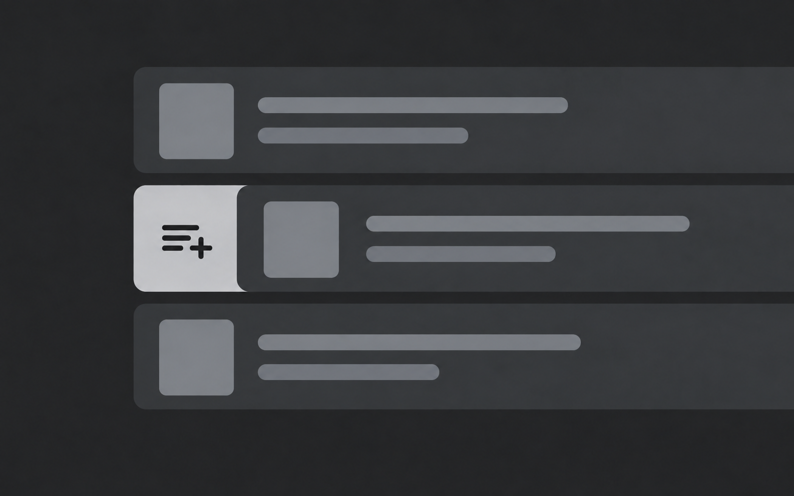
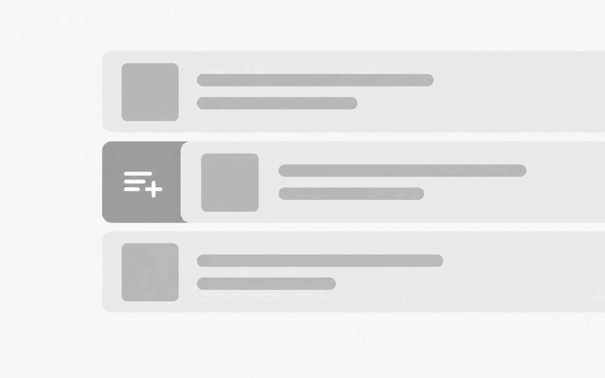

# Paired illustration example

This fictional list interaction demonstrates the shared scene contract and theme-specific prompts. It is not a screenshot or a claim about an existing product.

`scene.yaml` is the author-controlled brief. `dark.prompt.md` and `light.prompt.md` are compiled from that same brief and the default project palette. The selected raster pair is checked for interaction geometry, composition, visual hierarchy, and small-card readability.

The resting rows and the neutral action backplate share one fixed left boundary. Only the middle foreground row and its contents move to the right, by the width of the exposed action. This keeps the action inside the original list bounds. The [alignment edit prompt](alignment-edit.prompt.md) records the targeted correction to the earlier illustration.

The current gallery selects `dark-refined.png` and `light-refined.png`. Both use `raised` for foreground rows, `secondary` for thumbnails and incidental bars, and `primary` for the exposed action. The queue glyph uses the contrasting `surface` value in each theme. No accent is needed: neutral hierarchy and the revealed geometry explain the interaction. The [dark request](dark-refinement.prompt.md), [light counterpart request](light-refinement.prompt.md), and [dark output-size correction](dark-size-correction.prompt.md) record the actual edits. Earlier files, including the [soft light revision](light-palette-edit.prompt.md), remain revision sources; `dark.png` and `light.png` stay part of the public release snapshots.

The generator is intentionally outside the CLI. In a real project, run `image plan`, generate the requested variants with the agent's available tool or an external service, inspect them, and use `image import` to record the selected files.

| Dark | Light |
| --- | --- |
|  |  |

Both selected PNGs are 1586 × 992 pixels. The generator returned a size close to the requested 8:5 ratio; the files retain their actual dimensions. See [the pair review](pair-review.md) for generation steps and visual checks.
