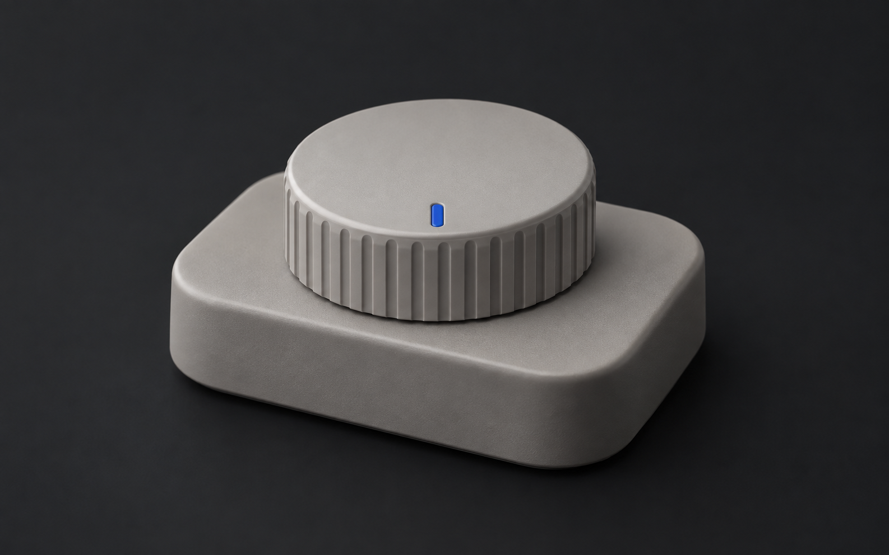
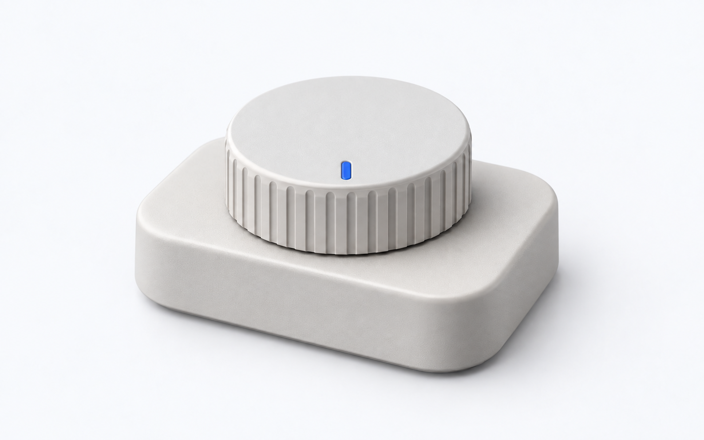

# Tactile dial

This is a retired generated exploration, not a current generation recipe or an approved product reference. It is excluded from the distributed package. Physical product details now require an actual capture, photograph, or approved asset through the [supplied-image workflow](../provided-media/README.md). The files below are retained only as historical work; do not use the old prompts to synthesize a replacement for a missing product image.

An original fictional `object-detail` example: The desktop timer gains a ribbed adjustment dial that is easier to locate by touch.

The former written fictional scene is not evidence of a real product and does not satisfy the current supplied-image requirement.

| Dark | Light |
| --- | --- |
|  |  |

Both selected PNGs are 1586 × 992 pixels.

- [Shared scene specification](scene.yaml)
- [Dark prompt](dark.prompt.md) and [light prompt](light.prompt.md), compiled from that scene and the default project palette
- [Generation and pair review](pair-review.md)
- [All eight composition examples](../README.md#composition-gallery)

The scene explains this feature only. Derive a new scene from each real note and its product evidence.
